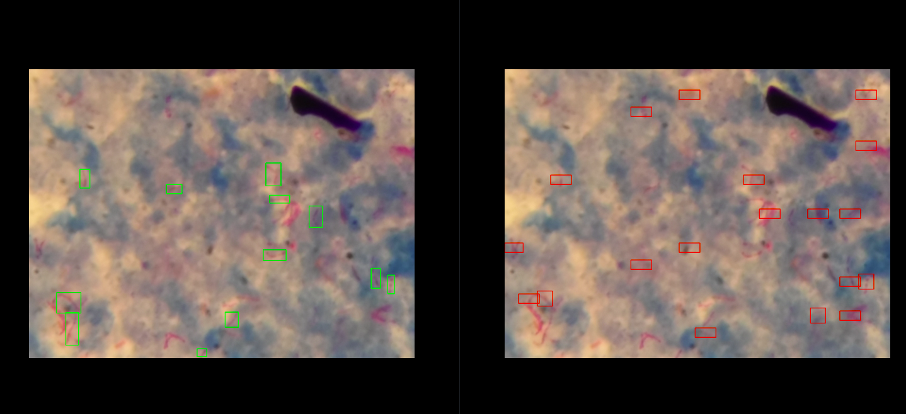
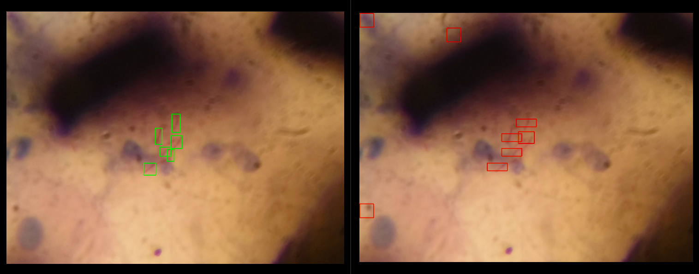
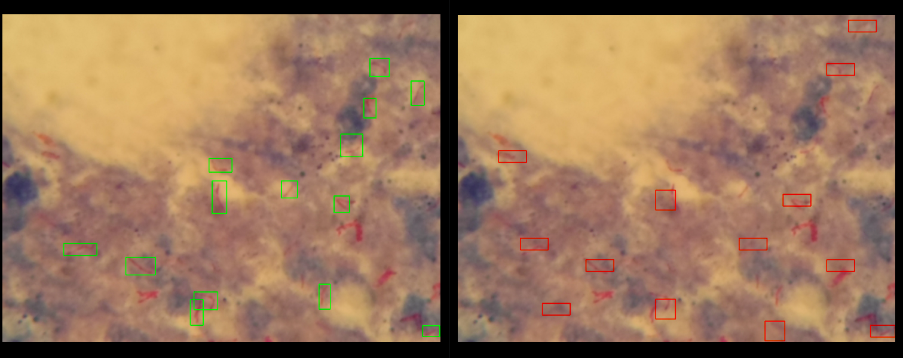
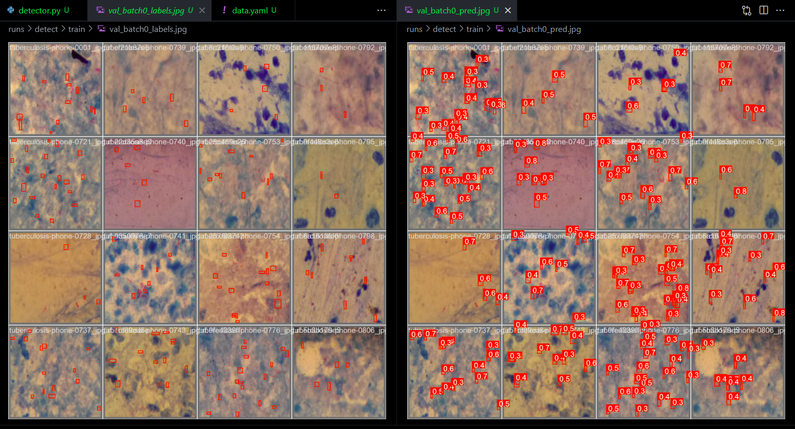
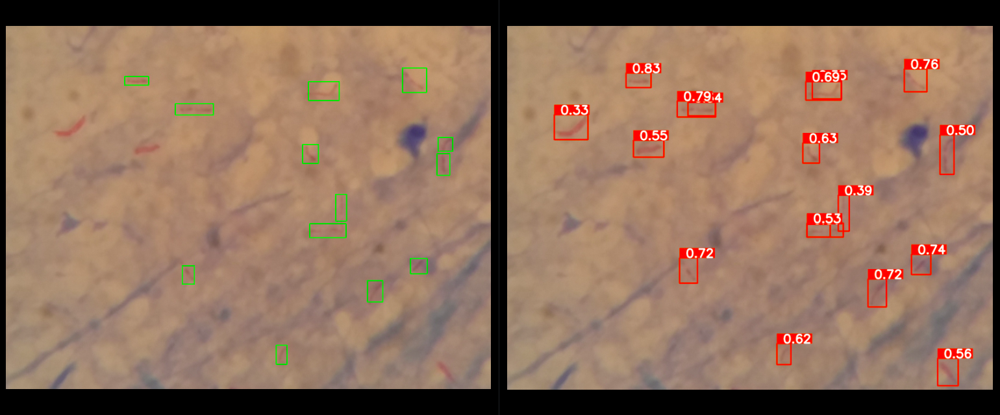
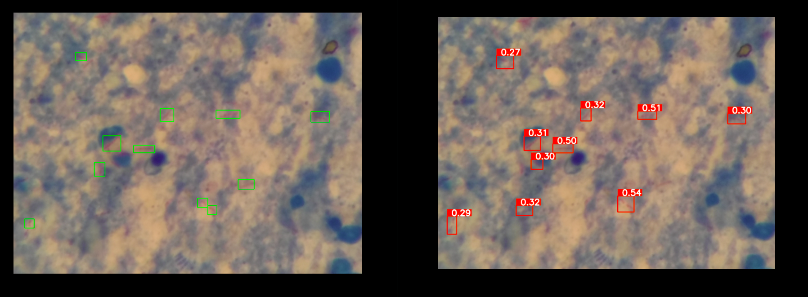

# Tuberculosis bacteria detection using YOLOv8

## Breif summary of tuberculosis

According to WHO (World Health Oranization), Tuberculosis (TB) also known colloquially as the "white death", is an infectious disease that most often affects the lungs and is caused by a type of bacteria, Mycobacterium tuberculosis (a species of pathogenic bacteria in the family Mycobacteriaceae and the causative agent of tuberculosis). First discovered in 1882 by Robert Koch, about a quarter of the global population is estimated to have been infected with TB bacteria. About 5–10% of people infected with TB will eventually get symptoms and develop TB disease.

A total of 1.3 million people died from TB in 2022 (including 167 000 people with HIV). Worldwide, TB is the second leading infectious killer after COVID-19 (above HIV and AIDS).

In 2022, an estimated 10.6 million people fell ill with tuberculosis (TB) worldwide, including 5.8 million men, 3.5 million women and 1.3 million children. TB is present in all countries and age groups. TB is curable and preventable.

In the scope of computer science and data science, this bacteria sample could be trainable data to develop deep learning models to detect bacteria from images with highly accurate results. Images of the bacteria could be conveniently collected through the microscope with the patient's sputum sample.

## Brief summary of the project

This project was conducted to apply a deep learning model (CNN) to detect bacteria from a given image of a patient's sputum. The aim of this project was to find an effective way to detect all the bacteria that exist in the image accurately.

The project has been through 2 periods of time. The previous approach was trying to crop some region samples of bacteria and environments from training images to feed the CNN model. Through the training process, the CNN model could classify a particular region from an image containing tuberculosis bacteria or not. However this approach proved to be cumbersome, it was calculation-expensive, and the result depended too much on how to cut regions on the image to determine the bounding box that wraps the bacteria, this approach is just a combination of classification and localization tasks, so it is not suitable for detecting bacteria on the images. After realizing the limit, the new approach was to find an image detection algorithm or newer deep learning models, RCNN, fast RCNN, or mask RCNN that could be suitable. And we've found that YOLOv8 could be potential for this project.

This is the result of the previous approach:

This is the result when applying YOLOv8:

## Why YOLOv8 suitable for image detection tasks?

YOLO (You Only Look Once) is a real-time object detection system that is well-suited for image detection tasks, particularly those involving bacterial and microbial images. Here are some key reasons why:

- Speed and efficiency: YOLO is known for its fast processing speed, making it ideal for real-time applications where rapid detection is crucial. This is especially important in the context of bacterial and microbial analysis, where timely identification of pathogens can be critical for patient care and outbreak prevention.

- Accuracy: YOLO achieves high accuracy in object detection, even with small and low-resolution images. This is essential for tasks involving bacterial and microbial images, which can often be challenging to identify due to their small size and complex morphology.

- Robustness: YOLO is a robust system that can be trained on a variety of datasets and applied to different types of images. This makes it adaptable to the diverse range of bacterial and microbial images that may be encountered in research and clinical settings.

- Extensibility: YOLO is an open-source framework that can be easily extended and customized to meet specific needs. This allows researchers and developers to tailor the system to their specific requirements for bacterial and microbial image analysis.

- Scalability: YOLO can be scaled to handle large datasets and high-throughput imaging applications. This is important for large-scale studies of bacterial and microbial communities, where the analysis of massive datasets is essential for gaining meaningful insights.

Overall, YOLO's speed, accuracy, robustness, extensibility, and scalability make it a powerful tool for bacterial and microbial image detection. Its ability to rapidly and accurately identify bacteria and other microorganisms from images can be a valuable asset in a variety of research, clinical, and industrial settings.

## More information

You can find the previous repository ò the previous approach via this link: https://github.com/TracDucAnh/Observing-Tuberculosis-Bacteria-Program

This repository is the new approach to performing this image detection tasks with YOLOv8: https://github.com/TracDucAnh/Tuberculosis_bacteria_detection

This project is a preliminary study, and there are several limitations that need to be addressed in future work.

This project is a small team project for learning purposes and may have many shortcomings. I hope you can give me some feedback.

This project is owned by DINH TRAC DUC ANH (HCM University of Technology), in collaboration with TRUONG QUANG ANH VU (Thu Dau Mot University).

Contact: 

- dinhtracducanh04092005@gmail.com

- tqavu1608@gmail.com
